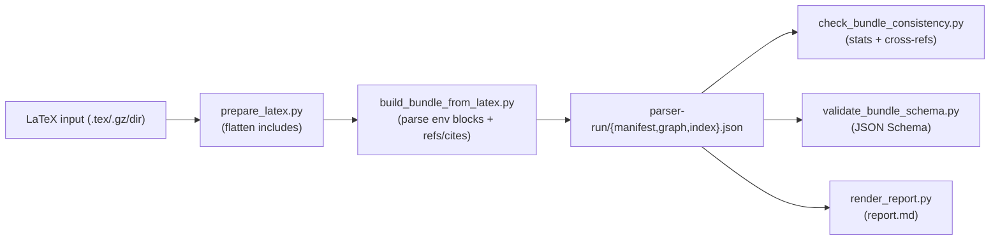

# Phase 3 — Agent Integration + Real Data (Design)

**Goal:** Make Phase 3 reproducible **locally** by providing CLI tooling that turns LaTeX sources into a **schema-valid** and **consistency-valid** PaperParser bundle, plus a static Markdown report suitable for review and dashboard ingestion.

**Non-goals (Phase 3):**
- Running a hosted LLM / “agent” inside this repo (no API calls).
- Using `/Users/hanzhicheng/Desktop/Coding/agent4math/PaperParser/ref/papers/MS_nextstage.pdf` (explicitly next-stage only).
- Implementing the dashboard (handled in a separate worktree).
- Full semantic proof decomposition or novelty calibration (bundle fields will be conservative placeholders where needed).

---

## Artifacts

### CLI tools (committed)

1) `tools/validate_bundle_schema.py`
- Validates `manifest.json`, `graph.json`, `index.json` against:
  - `schema/manifest.schema.json`
  - `schema/graph.schema.json`
  - `schema/index.schema.json`
- Uses the existing `jsonschema` Python dependency already available in the environment.

2) `tools/build_bundle_from_latex.py`
- Inputs: `.tex`, `.gz` containing TeX, or a directory containing `main.tex`.
- Uses `tools/prepare_latex.py` to create a flattened `*.flat.tex`.
- Extracts theorem-like environments by:
  - Parsing `\\newtheorem{env}{Printed Name}` declarations to map environment name → canonical node kind.
  - Scanning for `\\begin{env} ... \\end{env}` blocks to create nodes.
- Extracts:
  - `latex_label` from `\\label{...}` within the environment block.
  - `uses_in_proof` edges from `\\ref{...}` / `\\eqref{...}` occurrences inside statements.
  - `cites_external` edges from `\\cite{...}` occurrences (creates `external_dependency` nodes).
- Produces:
  - `manifest.json`, `graph.json`, `index.json`
  - A basic `report.md` rendered from the bundle (static review artifact).

3) `tools/render_report.py`
- Deterministically renders a `report.md` from a bundle directory (no dashboard required).

### Local runs (not committed)

Bundles + report outputs are produced under `ref/runs/` (ignored by `.gitignore`):
- `ref/runs/medium_mueller/`
- `ref/runs/long_nalini/`

Each run contains:
```
parser-run/
  manifest.json
  graph.json
  index.json
report.md
```

---

## Data flow



---

## Validation rules

Every generated bundle must satisfy:
- `tools/validate_bundle_schema.py` passes for all three JSON files.
- `tools/check_bundle_consistency.py` passes for the run directory.

---

## Limitations (accepted for Phase 3)

- Section numbering is inferred from `\\section` / `\\subsection` order (no TeX compilation).
- Node `number` is best-effort (derived from counters), not guaranteed to match the compiled PDF.
- Proof status, novelty, and narrative fields in `index.json` are conservative placeholders.
- Edges are intentionally minimal:
  - only explicit in-statement `\\ref`-based dependencies and `\\cite`-based external dependencies.

